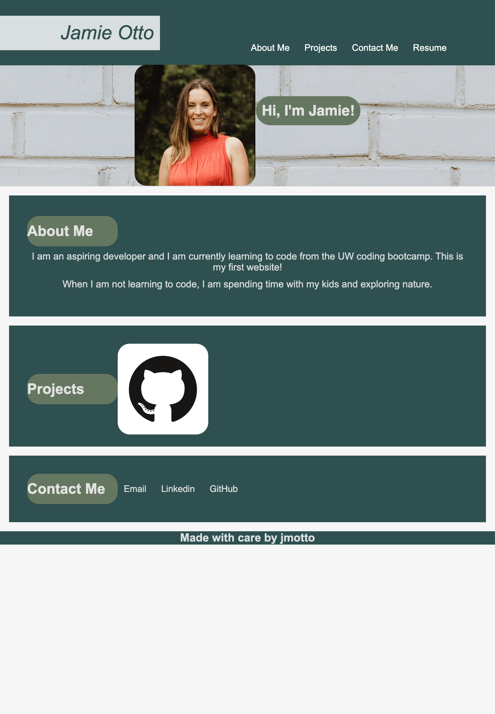

# Jamie Otto's Portfolio

## Portfolio Challenge 

The portfolio challenge is to build a webpage from scratch displaying my work and information about me. This webpage includes a navigation bar to information about me, my projects, and contact information, as well as, a link to my resume. It also includes a photo of myself and links to my email, linkedin, and github. 

### Hiccups:

* I ran into a lot of issues with positioning text and boxes. This was definitely good practice and I will have to dive into it a bit more to repositon items where I intended. 

* I struggled a bit with the media screen sizing as well. 

### My Portfolio
[Jamie's Portfolio](https://jmotto.github.io/My-Portfolio/)

